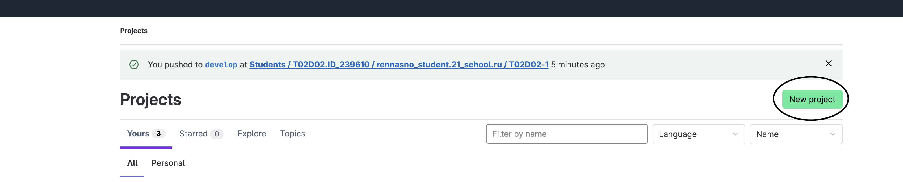
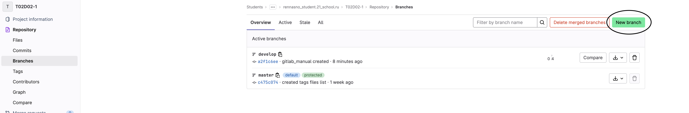
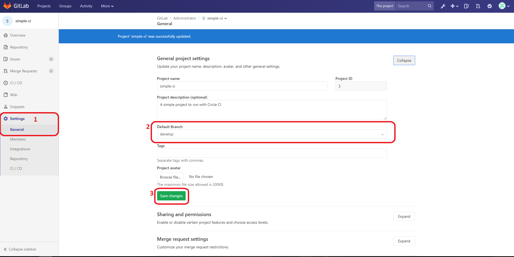
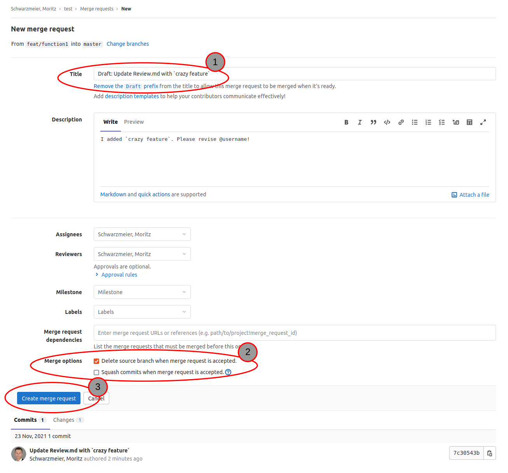
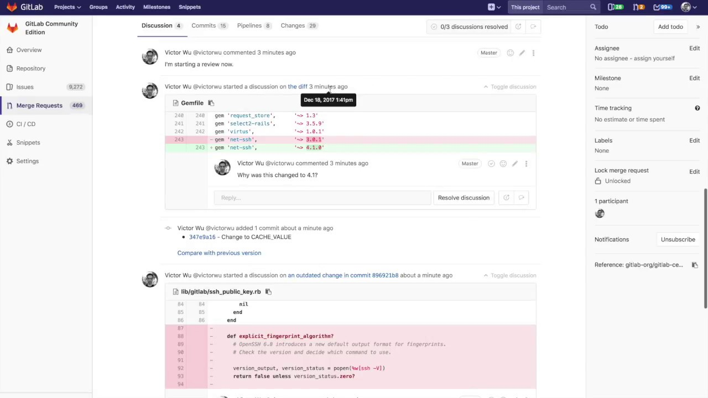

# GitLab Manual

## Создание личного репозитория

1. Войдите в ваш аккаунт GitLab.
2. Нажмите на кнопку "New project".
3. Укажите название репозитория и выберите "Initialize repository with a README".
4. Создайте файл `.gitignore` через интерфейс, добавив в него необходимые правила.

5. Нажмите "Create project".

## Создание веток `develop` и `master`

1. Перейдите в раздел "Repository" вашего проекта.
2. Откройте "Branches".
3. Введите `develop` в поле создания новой ветки и создайте ветку от `master`.

## Установка ветки `develop` по умолчанию

1. В разделе "Branches" найдите ветку `develop`.
2. Нажмите на кнопку "Set as default" рядом с её именем.

## Создание задачи (issue) на разработку мануала

1. Перейдите в раздел "Issues" вашего проекта.
2. Нажмите на "New issue".
3. Заполните заголовок и описание задачи, например, "Создать мануал" и описания всех требуемых шагов.
4. Нажмите "Submit issue".

## Создание ветки по issue

1. Нажмите на созданную задачу в разделе "Issues".
2. Нажмите на кнопку "Create merge request".
3. Выберите "Create a new branch" и задайте имя, например, `feature/manual`.
4. Нажмите "Create branch".

## Создание merge request в ветку `develop`

1. Перейдите в раздел "Merge requests".
2. Нажмите на "New merge request".
3. Выберите вашу ветку (`feature/manual`) для слияния с `develop`.
4. Заполните заголовок и описание merge request.
5. Нажмите "Submit merge request".

## Комментирование и принятие реквеста

1. Откройте ваш merge request.
2. Добавьте комментарии к изменениям.
3. После обсуждения нажмите "Merge" для принятия изменений в ветку `develop`.

## Формирование стабильной версии в `master` с простановкой тега

1. Перейдите в ветку `develop` и убедитесь, что все изменения протестированы.
2. Создайте новый merge request из `develop` в `master`.
3. После слияния, чтобы создать тег, откройте терминал и выполните следующие команды:

   git checkout master
   git tag -a v1.0 -m "Стабильная версия 1.0"
   git push origin v1.0
   

## Работа с Wiki проекта

1. В вашем проекте выберите "Wiki" из меню.
2. Нажмите на "Create your first page", чтобы начать.
3. Создайте и редактируйте страницы, добавляя нужный контент.

# Заключение

С помощью данного мануала вы сможете легко организовать процесс работы с GitLab, включая создание репозиториев, управление ветками, задачами и документацией.
